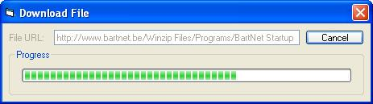



## \_BartNet File Downloader \(Active X version\)\_

### Description

This is an active x control that will download a file for you. It makes the job a lot easier and it comes with a demo program that shows how to monitor the progress using a progress bar.
 
### More Info
 

             |
---                |---
**Submitted On**   |2004-06-28 07:43:18
**By**             |[BelgiumBoy\_007](https://github.com/Planet-Source-Code/PSCIndex/blob/master/ByAuthor/belgiumboy-007.md)
**Level**          |Advanced
**User Rating**    |4.8 (115 globes from 24 users)
**Compatibility**  |VB 6\.0
**Category**       |[OLE/ COM/ DCOM/ Active\-X](https://github.com/Planet-Source-Code/PSCIndex/blob/master/ByCategory/ole-com-dcom-active-x__1-29.md)
**World**          |[Visual Basic](https://github.com/Planet-Source-Code/PSCIndex/blob/master/ByWorld/visual-basic.md)
**Archive File**   |[\_BartNet\_F1763196282004\.zip](https://github.com/Planet-Source-Code/belgiumboy-007-bartnet-file-downloader-active-x-version__1-54640/archive/master.zip)

